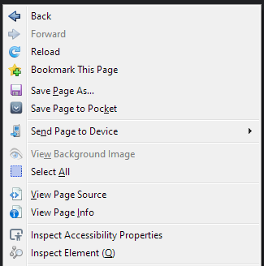

## firefox-aero-css
Firefox 3.6-inspired aero CSS for 78ESR/79

## Thank you to:

- Ryu (created the original aero theme mod)
- B00ze64 (created the Firefox Menu Icons Plus theme)
- avenged110 (created part of the about dialog)

## Screenshots:

